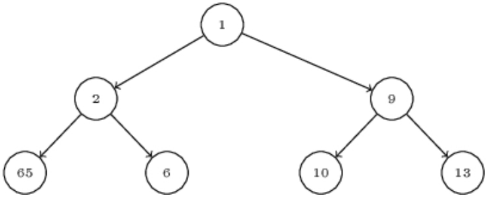
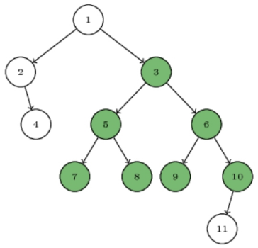

## Demo

Write a function:

  `function solution(A);`

that, given an array A of N integers, returns the smallest positive integer (greater than 0) that does not occur in A.

For example, given A = [1, 3, 6, 4, 1, 2], the function should return 5.

Given A = [1, 2, 3], the function should return 4.
Given A = [-1, -3], the function should return 1.

Assume that:
  * N is an integer within the range [1..100,000];
  * each element of array A is an integer within the range [-1,000,000..1,000,000].

Complexity:
  * expected worst-case time complexity is O(N);
  * expected worst-case space complexity is O(N), beyond input storage (not counting the storage required for input 

-----

## 01

An interval is a pair (A, B) of integers such that A <= B. Two intervals (A, B) and (C, D) overlap if there exists an integer L such that A <= L <= B and C <= L <= D. Intervals that do not overlap are called disjoint. The union of intervals (A, B) and (C, D) is defined as:

  * either a single interval (min(A, C), max(B, D)), when (A, B) and (C, D) overlap, or
  * the intervals (A, B) and (C, D) themselves, when they are disjoint.

Taking the union of two intervals is a commutative and associative operation, so it 
can be extended to an arbitrary number of intervals.

For example, consider the following eight intervals:
```
    ( 1,   5)       (12,   15)        (42,   44)
    (70,  72)       (36,   36)        (-4,    2)
    (43,  69)       (15,   24)
```

Intervals (1, 5) and (-4, 2) overlap and their union is (-4, 5). Intervals (12, 15) and (15, 24) overlap and their union is (12, 24). Intervals (42, 44) and (43, 69) overlap and their union is (42, 69). Intervals (70, 72) and (36, 36) are disjoint and do not overlap with other intervals. The union of all eight intervals consists of the following five pairwise disjoint intervals:
```
    (-4,  5)        (12, 24)         (42, 69)
    (70, 72)        (36, 36)
```

Write a function:

  `function solution(A, B);`

that, given two zero-indexed arrays A and B consisting of N elements each, returns the number of pairwise disjoint intervals constituting the union of N intervals described by arrays A and B. The K-th interval, where K is an integer within the range [0..(N - 1)], is defined as (A[K], B[K]).

For example, given the following arrays A and B consisting of eight elements each:
```
    A[0] =  1    A[1] = 12    A[2] = 42
    A[3] = 70    A[4] = 36    A[5] = -4
    A[6] = 43    A[7] = 15
```
```
    B[0] =  5    B[1] = 15    B[2] = 44
    B[3] = 72    B[4] = 36    B[5] = 2
    B[6] = 69    B[7] = 24
```

the function should return 5, because the intervals described by these arrays correspond to the example above. Assume that: 
  * N is an integer within the range [0..100,000];
  * each element of arrays A, B is an integer within the range [-1,000,000,000..1,000,000,000]; 
  * A[K] <= B[K] for integers K within the range [0..(N - 1)].

Complexity: 
  * expected worst-case time complexity is `O(N*log(N))`;
  * expected worst-case space complexity is `O(N)`, beyond input storage (not counting the storage required for input arguments). 

-----

## 02

Note that the values contained in the nodes are not relevant in this task. 

A binary tree is called perfect if all of its nodes have exactly 0 or 2 children and all of its leaves are at the same level. By the size of a perfect tree we mean its number of nodes. 

Example of a perfect tree of size 7:

  


Your task is to calculate the size of the biggest perfect subtree that can be obtained by removing any number of nodes. Consider the following binary tree: 

  


After removing nodes 1, 2, 4 and 11, you obtain a perfect tree of size 7 (as shown by the green nodes). Perfect trees of size 3 are rooted at: 1, 3, 5 and 6, but they are obviously smaller than the best answer of 7. 

Write a function: 

  `function solution(T); `

that, given a non-empty binary tree T consisting of N nodes, returns the size of the biggest perfect subtree that can be obtained by removing nodes. 

For example, given tree T as shown in the previous figure, the function should return 7, as explained above. 

Assume that: 
  * N is an integer within the range [1..100,000];
  * the height of tree T (number of edges on the longest path from root to leaf) is within the range [0..800]. 

Complexity: 
  * expected worst-case time complexity is `O(N)`;
  * expected worst-case space complexity is `O(N)`. 


Technical details 

A binary tree can be specified using a pointer data structure. Assume that the following declarations are given: 
```
  // Tree obj is an Object with attributes 
  // obj.x - type: int 
  // obj.l - type: Tree 
  // obj.r - type: Tree 
```
An empty tree is represented by an empty pointer (denoted by null). A non-empty tree is represented by a pointer to an object representing its root. The attribute x holds the integer contained in the root, whereas attributes l and r hold the left and right subtrees of the binary tree, respectively. 

For the purpose of entering your own test cases, you can denote a tree recursively in the following way. An empty binary tree is denoted by None. A non-empty tree is denoted as (X, L, R), where X is the value contained in the root and L and R denote the left and right subtrees, respectively. The tree from the above figure can be denoted as: 
```
(1, (2, None, (4, None, None)), (3, (5, (7, None, None), (8, None, None ) ) , ( 6 , ( 9 , None, None ) , ( 10 , ( 11, None, None ) , None ) ) ) )
```

-----

## 03

A chessboard consisting of N rows and M columns is given. Each square of the board is either empty or blocked. 

A knight is a chess piece that perform the following moves in one turn: 

  * two squares up and one square left;
  * two squares up and one square right;
  * one square up and two squares left;
  * one square up and two squares right;
  * one square down and two squares left;
  * one square down and two squares right;
  * two squares down and one square left;
  * two squares down and one square right. 

The number of possible moves can be reduced if the knight would fall off the board or if the destination square is blocked. 

The board can be described by a zero-indexed matrix consisting of N rows and M columns of integers. A square of the board is empty if its corresponding matrix element has value 0 and blocked if its corresponding matrix element has value 1. 

For example, consider the following matrix A consisting of four rows and three columns: 
```
    A[0][0] = 0    A[0][1] = 0    A[0][2] = 0
    A[1][0] = 0    A[1][1] = 0    A[1][2] = 1
    A[2][0] = 1    A[2][1] = 0    A[2][2] = 0
    A[3][0] = 0    A[3][1] = 0    A[3][2] = 0
``` 

Consider a knight standing on the upper-left square. It requires seven turns to move to the lower-right square: 

  * in the first turn the knight moves from square (0, 0) to square (2, 1);
  * in the second turn the knight moves from square (2, 1) to square (0, 2);
  * in the third turn the knight moves from square (0, 2) to square (1, 0);
  * in the fourth turn the knight moves from square (1, 0) to square (2, 2);
  * in the fifth turn the knight moves from square (2, 2) to square (3, 0);
  * in the sixth turn the knight moves from square (3, 0) to square (1, 1);
  * in the seventh turn the knight moves from square (1, 1) to square (3, 2). 

Note that a shorter path of length three exists, but the knight cannot take it because some of the squares along this path are blocked. 

Write a function: 

  `function solution(A);`
 
that, given a zero-indexed matrix A consisting of N rows and M columns describing chessboard, returns the minimum number of turns that the knight requires to move from the upper-left square to the lower-right square. The function should return -1 if it is impossible for the knight to move from the upper-left square to the lower-right square. 

Assume that: 
  * N and M are integers within the range [1..1,000,000];
  * the number of elements in matrix A is within the range [1..1,000,000];
  * each element of matrix A is an integer that can have one of the following values: 0, 1;
  * `A[0][0] = A[N-1][M-1] = 0`

For example, given matrix A consisting of four rows and three columns such that: 
```
    A[0][0] = 0    A[0][1] = 0    A[0][2] = 0
    A[1][0] = 0    A[1][1] = 0    A[1][2] = 1
    A[2][0] = 1    A[2][1] = 0    A[2][2] = 0
    A[3][0] = 0    A[3][1] = 0    A[3][2] = 0
```
the function should return 7, as explained in the example above. 

Complexity: 
  * expected worst-case time complexity is `O(N*M)`;
  * expected worst-case space complexity is `O(N*M)`. 

-----

## 04

A non-empty zero-indexed array A consisting of N integers is given. The array is sorted in ascending order and it does not contain duplicate values. The array describes a number K as follows: 

  * `K = pow2(A[0]) + pow2(A[1]) + ... + pow2(A[N-1])`
  * `pow2(L) = 2^L`

For example, consider array A consisting of three elements such that
```
    A[0] = 1    A[1] = 4    A[2] = 5 
```
It describes the number K = 50, because 
```
    pow2(A[0]) + pow2(A[1]) + pow2(A[2]) = 
    pow2 ( 1 ) + pow2 ( 4 ) + pow2 ( 5 ) = 
    2          + 16         + 32         = 50 
```

Write a function
 
  `function solution(A);`

that, given a non-empty zero-indexed array A consisting of N non-negative integers, returns the number of bits set to 1 in the binary representation of the number 3*K, where K is the number described by array A. 

Assume that: 
  * N is an integer within the range [1..10,000];
  * each element of array A is an integer within the range [0..1,000,000,000];
  * array A is sorted in non-decreasing order;
  * array A does not contain duplicates. 

For example, given array A consisting of three elements such that 
```
    A[0] = 1    A[1] = 4    A[2] = 5 
```
the function should return 4 because: 
  * array A represents number K = 50, as explained above;
  * `3*K = 3*50 = 150`;
  * the binary representation of 150 is 10010110; 
  * it contains four bits set to 1. 

Complexity: 
  * expected worst-case time complexity is `O(N)`;
  * expected worst-case space complexity is `O(1)`, beyond input storage (not counting the storage required for input arguments). 

-----

## 05

We say that a character is unique in string S if it occurs exactly once in it. For example, in string S = "ACAX", the only unique characters are "C" and "X". 

Let's define UNI(S) as the number of unique characters in string S. For example, UNI("ACAX") equals 2. 

Given a string S, calculate the sum of UNI(S') over all non-empty substrings S'. If there are two or more equal substrings at different positions in S, we consider them different. 

Since the answer can be very large, provide it modulo 1,000,000,007 (10^9 + 7). 

Write a function: 

  `function solution(S); `

that, given a non-empty string S consisting of uppercase letters, returns the sum of UNI(S) over all non-empty substrings S' of S modulo 1,000,000,007.
 
For example, given "ACAX", your function should return 16, as explained visually as follows: 
```
    UNI ( "A" ) = 1 
    UNI ( "AC " ) = 2 
    UNI ( "ACA" ) = 1 
    UNI ( "ACAX" ) = 2 
    UNI ( "C" ) = 1 
    UNI ( "CA" ) = 2 
    UNI ( "CAX" ) = 3 
    UNI ( "A" ) = 1 
    UNI ( "AX" ) = 2 
    UNI ( "X" ) = 1 
    Total : 16 
```

Given "CODILITY", your function should return 96. 

Assume that: 
  * the length of S is within the range [4..100,000];
  * string S consists only of uppercase letters (A-z). 

Complexity:  
  * expected worst-case time complexity is `O(N)`;
  * expected worst-case space complexity is `O(N)` (not counting the storage required for input arguments). 

-----

## 06

A matrix A of size N*M containing Boolean values is given. We say that a square of size L can be placed in A at position (X,Y) if: 
  * 0 < L <= min(N,M),
  * 0 <= X <= N-L,
  * 0 <= Y <= M-L, and
  * A[X+I][Y+J] = true for all 0 <= I < L and 0 <= J < L. 

If a square of size L can be placed at (X,Y), and at (X+1,Y) or (X,Y+1), then we say that it can be moved (in a single move) from (X,Y) to, respectively, (X+1,Y) or (X,Y+1). 

We are looking for the largest L such that: 
  * A square of size L can initially be placed at (0,0);
  * The square can be moved, by a sequence of moves, from (0,0) to (N-L, M-L). 

In other words, we are looking for the largest square that can be moved from the upper-left to the lower-right corner, over elements of the matrix that are equal to true, by moving it downwards and to the right. In particular, if all elements of array A are true, then L = min(N,M). 

Write a function:
  
  `function solution(A);`

that, given a matrix A of size N*M containing Boolean values, returns size L of the largest square satisfying the above conditions. If there is no such L, the function should return 0. 

For example, given array A: 
```
    A[0][0] = true    A[0][1] = true    A[0][2] = true    A[0][3] = false
    A[1][0] = true    A[1][1] = true    A[1][2] = true    A[1][3] = false
    A[2][0] = true    A[2][1] = true    A[2][2] = true    A[2][3] = false
    A[3][0] = true    A[3][1] = true    A[3][2] = true    A[3][3] = true
    A[4][0] = false   A[4][1] = true    A[4][2] = true    A[4][3] = true 
    A[5][0] = true    A[5][1] = false   A[5][2] = true    A[5][3] = true 
```
the function should return 2. 


Given array A: 
```
    A[0][0] = true    A[0][1] = true    A[0][2] = false   A[0][3] = false
    A[1][0] = true    A[1][1] = false   A[1][2] = false   A[1][3] = false
    A[2][0] = false   A[2][1] = true    A[2][2] = false   A[2][3] = true 
```
the function should return 0.


Given array A: 
```
    A[0][0] = true
```
the function should return 1. 

Assume that:
  * N and M are integers within the range [1..300].

Complexity: 
  * expected worst-case time complexity is `O(N*M*log(N+M))`;
  * expected worst-case space complexity is `O(N*M)`. 

-----
